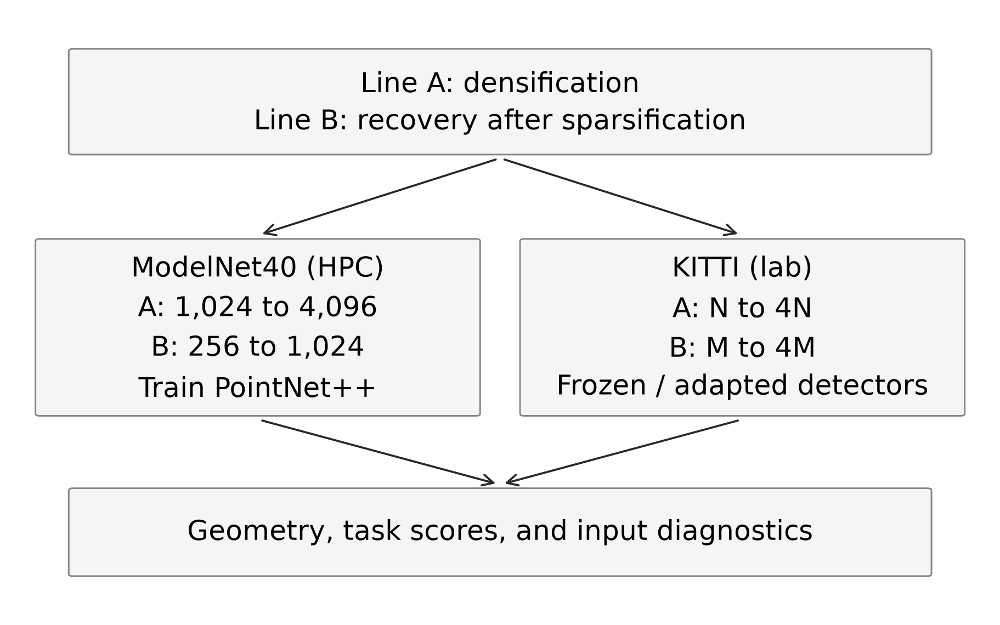
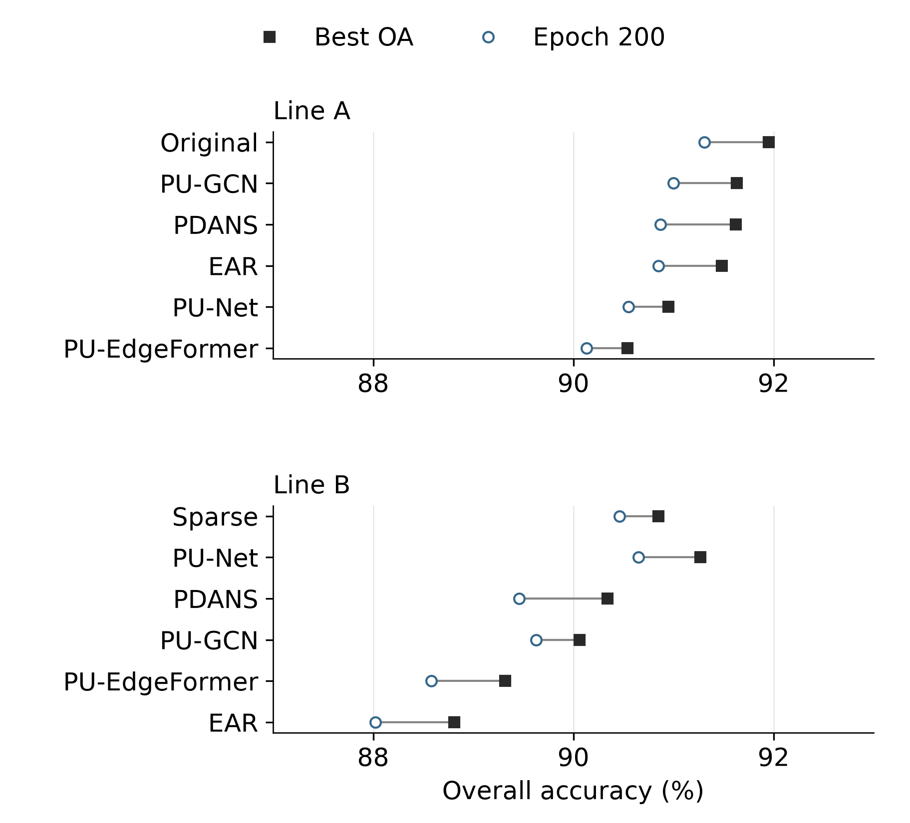
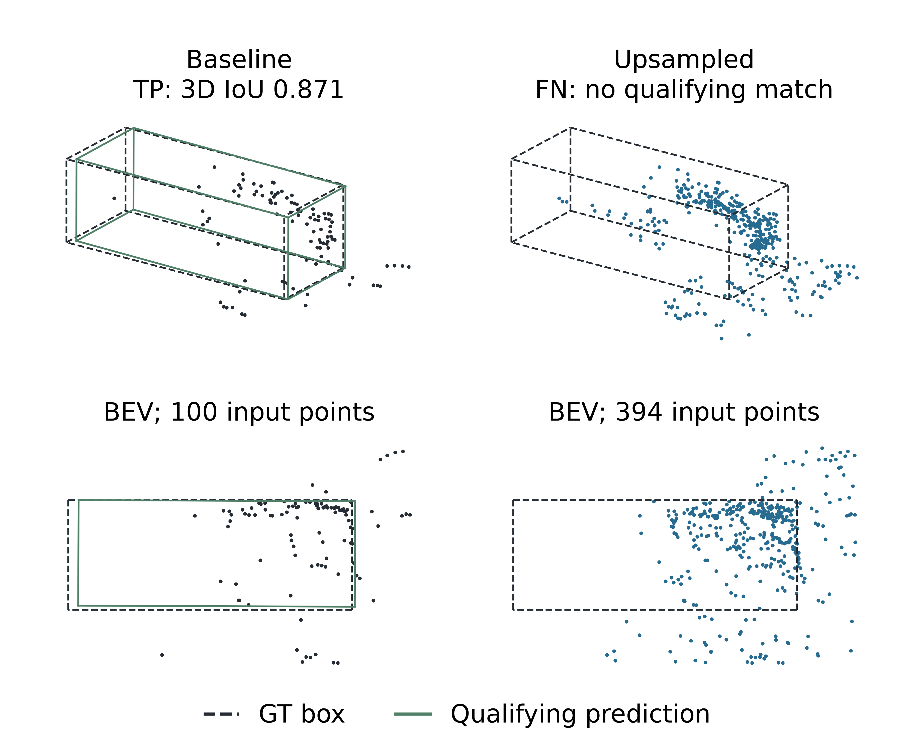

# Point Cloud Upsampling for 3D Perception

**When do more points help a downstream model?** This thesis compares point-cloud densification and sparse-input recovery on ModelNet40 classification and KITTI LiDAR detection. Its central finding is that geometric improvement does not guarantee better recognition: input selection, the detector's point or voxel budget, and adaptation to the new input distribution all matter.

**Jiahui Shen** · Master's thesis · FAU Erlangen-Nürnberg, LMS · September 2026

Supervisor: Marina Ritthaler, M.Sc.

Formal title: *Investigating the Impact of Point Cloud Upsampling on 3D Object Detection Performance*

[Thesis PDF](thesis.pdf) · [Run the project](docs/REPRODUCING.md) · [Code walkthrough](docs/CODE_WALKTHROUGH.md) · [Technology stack](docs/TECH_STACK.md) · [Archive and handover](docs/ARCHIVE_GUIDE.md)



## Explore the project

| Interest | What to inspect | Starting point |
| --- | --- | --- |
| Machine learning / computer vision engineering | Dataset contracts, strict point counts, training and evaluation, checkpoint inference, traceable result generation | [Training and evaluation](docs/CODE_WALKTHROUGH.md#training-and-evaluation) |
| Research | Controlled input lines, equal-cardinality geometry, baselines, negative results, selection bias and reproducibility limits | [Experimental evidence](docs/CODE_WALKTHROUGH.md#experimental-evidence) |
| Perception | LiDAR upsampling integration, observed-point retention, fixed point and voxel budgets, detector adaptation, object-level failures | [LiDAR perception](docs/CODE_WALKTHROUGH.md#lidar-perception) |

## Technology stack

The project connects deep-learning frameworks, 3D geometry processing, LiDAR detection, HPC experiment execution and reproducible reporting. The table below maps the stack to actual work in the repository; the [detailed technical guide](docs/TECH_STACK.md) provides model details, exact code locations and separate environment/version records.

| Area | Technologies and methods | How they are used |
| --- | --- | --- |
| **Core development** | Python, Bash, NumPy, `argparse`, `pathlib`, dataclasses, subprocesses | Numerical point-cloud pipelines, command-line tools, method wrappers and file-based interfaces between environments |
| **Deep-learning frameworks** | PyTorch, legacy TensorFlow 1.x, NVIDIA CUDA | Classifier training, detector adaptation and pretrained upsampler inference across method-specific environments |
| **3D classification** | PointNet++ SSG, set abstraction, farthest-point sampling, radius-based grouping, batch normalization, dropout | Separately train classifiers on each input representation and execute archived weights in the [CPU demo](tools/demo_inference.py) |
| **Upsampling methods** | EAR-style geometry, PU-Net, PU-GCN / NodeShuffle, PU-EdgeFormer / EdgeConv and attention, PDANS / diffusion | Compare five methods on densification and sparse-input recovery; integrate their released inference paths and weights |
| **3D object detection** | PointRCNN, RPN/RCNN stages, CenterPoint, OpenPCDet, spconv | Compare point-based and voxel-based perception pipelines, including frozen inference and detector adaptation |
| **Spatial computation** | SciPy `cKDTree`, scikit-learn `NearestNeighbors`, PyTorch3D GPU kNN | Nearest-neighbour distances, local radius queries, intensity assignment, similarity audits and method operator validation |
| **Data preparation** | OFF mesh parsing, area-weighted surface sampling, centroid/unit-sphere normalization, seeded downsampling | Prepare consistent ModelNet40 variants and references; preserve sample identity and strict point counts |
| **LiDAR processing** | Float32 XYZI, spatial patches, FPS/ball-cover/kNN support, inverse patch transforms, observed-first assembly | Generate and merge local outputs, restore scene coordinates and retain measured observations |
| **Detector interfaces** | Calibration/FOV filtering, fixed point budgets, voxel occupancy, 3D/BEV boxes, rotated NMS | Trace which points reach the detector and inspect proposal-level or object-level failure mechanisms |
| **Training and monitoring** | PyTorch Dataset/DataLoader, Adam, StepLR, augmentation, checkpoint state, `tqdm`, TensorBoardX | Run controlled classifier experiments and inspect detector training/convergence records |
| **Research evaluation** | OA, mean class accuracy, unsquared Chamfer distance, Hausdorff distance, NUC, KITTI AP_R40 | Separate geometric quality from recognition performance, retaining split, reference and checkpoint-selection labels |
| **HPC and execution** | Linux, Slurm, GPU/CPU jobs, job arrays, Conda, environment modules, `ProcessPoolExecutor` | Schedule independent runs, parallelize object processing, resume incomplete generation and audit completion |
| **GPU compatibility** | CUDA toolkit, GCC / `nvcc`, custom-op compilation, TensorFlow linker paths, device/precision checks | Integrate legacy research operators and resolve environment or data-validity failures |
| **Visualization** | Matplotlib, Plotly, Open3D, Pillow, OpenCV | Produce scientific plots, interactive 3D views, BEV comparisons and image/presentation assets |
| **Reporting and writing** | pandas, CSV/JSON/YAML, python-pptx, ReportLab, LaTeX, BibTeX, latexmk | Export numerical reports, editable slides, research dossiers and the thesis manuscript |
| **Reproducibility and delivery** | Git, Git LFS, SHA-256, Python `unittest`, GitHub Actions, `venv` / pip | Version source and assets, validate evidence, execute a real inference smoke test and verify complete downloads |

**Verified portable demo:** Python **3.12**, PyTorch **2.6.0+cpu**, NumPy **2.2.6**, with Windows execution and Linux CI. Historical GPU versions are documented per method in the [environment matrix](docs/TECH_STACK.md#10-version-and-environment-evidence); the CPU requirements do not describe every research environment.

**Engineering details to inspect:** strict data-shape/count checks, deterministic sparse-input selection, manifest/path recovery, resumed generation, shared-filesystem read checks, GPU operator compatibility, point/voxel-budget diagnostics and source-hash traceability. The [technology guide](docs/TECH_STACK.md) and [contribution map](docs/CODE_WALKTHROUGH.md) distinguish project integration work from reused architectures and upstream components.

## Contributions and implementation

- **Built the comparative experiment pipeline:** two input lines, five upsampling methods, separately trained PointNet++ classifiers, and equal-cardinality geometric evaluation. The archive contains **14 final/control classifier runs**, each with a 200-epoch log, metrics, saved model source and a best checkpoint.
- **Implemented data and evaluation tooling:** deterministic data handling, explicit point-count checks, per-shape geometric reports, classification summaries and per-class inspection. See the [dataset loader](research/modelnet40/code/scripts/modelnet_npy_dataloader.py) and [training driver](research/modelnet40/code/scripts/train_pointnet2.py).
- **Integrated upsampled LiDAR with two detection pipelines:** PointRCNN and CenterPoint, including observed-first assembly, input-budget diagnostics and detector adaptation. See [the perception code map](docs/CODE_WALKTHROUGH.md#lidar-perception).
- **Connected failures to evidence:** aggregate metrics, convergence curves, retained-observation analysis and selected object-level diagnostics explain why extra points can fail to improve detection.
- **Packaged an executable research artifact:** [result reconstruction](tools/reproduce_results.py), [real checkpoint inference](tools/demo_inference.py), integrity tests and SHA-256 provenance make the recorded evidence inspectable without the original cluster.

The thesis contribution is the experimental design, integration, analysis and supporting implementation. PointNet++, the upsampling architectures and the detector backbones build on existing research implementations. **EAR denotes the project's EAR-style geometric implementation**, whose exact equivalence to the published EAR method is not established. [Attribution and scope](docs/CODE_WALKTHROUGH.md#authorship-and-reused-components).

## Selected findings

### ModelNet40: geometry and recognition can disagree

Line A densifies 1,024 points to 4,096. Line B first reduces 1,024 points to 256, then recovers 1,024. Each upsampled variant has its own classifier trained from scratch.

| Input / method | Points | Best test OA (%) | Change from its line baseline (percentage points) |
| --- | ---: | ---: | ---: |
| A: Original baseline | 1,024 | 91.95 | — |
| A: PU-GCN | 4,096 | 91.63 | −0.32 |
| B: Sparse baseline | 256 | 90.85 | — |
| B: PU-Net | 1,024 | 91.27 | +0.42 |
| B: PU-GCN | 1,024 | 90.06 | −0.79 |

PU-GCN has the lowest mean Chamfer distance among the evaluated upsamplers in both lines, but it does not have the highest classification accuracy in Line B. PU-Net's recovery improves the sparse baseline while remaining **0.68 percentage points below the original 1,024-point baseline**.



**Protocol:** ModelNet40 train/test split (9,843 / 2,468 shapes), 200 epochs, seed 42. These OA/mAcc values retain the archived batch-average implementation; best checkpoints were selected on the test set. They are descriptive single-seed results, not validation-selected or multi-seed significance claims. [All classification rows](research/modelnet40/results/reports/modelnet40_pointnet2_final_classification_report_with_pu_edgeformer.csv) · [Geometry protocol](research/modelnet40/results/reports/modelnet40_geometry_equal_n_protocol.md).

### KITTI: adaptation recovers performance, with a remaining baseline gap

**Car 3D Moderate AP_R40 on all 3,769 validation frames.** Both adapted and unadapted columns below use the same PU-GCN observed-first input; the upsampler stays frozen.

| Detector | Input line | Unadapted AP | Best extended-adaptation AP | Gain (AP points) | Reference baseline AP |
| --- | --- | ---: | ---: | ---: | ---: |
| PointRCNN | A: densification | 64.27 | 71.59 | +7.32 | 81.95 |
| PointRCNN | B: sparse recovery | 35.53 | 57.05 | +21.52 | 68.33 |
| CenterPoint | A: densification | 63.21 | 75.97 | +12.76 | 79.28 |
| CenterPoint | B: sparse recovery | 44.09 | 62.90 | +18.81 | 68.05 |

The large recovery gains compare adaptation with the same input before adaptation. All four extended results remain below their reference baseline. Line A uses the original-input official baseline; Line B uses the archived three-epoch adapted sparse baseline. **Training budgets differ**, so this table does not isolate an equal-budget causal effect or establish a new detector benchmark. [Convergence and selection details](docs/REPRODUCING.md#metric-and-checkpoint-contracts).

<details>
<summary>Perception failure case: more input points, a missed car</summary>



This selected CenterPoint example changes from a true positive (3D IoU 0.871) to no qualifying match despite a denser local cloud. It illustrates an object-level failure; it is not a full-validation AP estimate. See the [detector-box comparison code](research/kitti/source/pointrcnn_workspace/scripts/compare_patch_causal_detector_boxes.py) for related diagnostic tooling.

</details>

## Run it locally

There are three different reproducibility levels. The first two run with this repository; full experimental retraining requires the external assets listed in the guide.

### 1. Rebuild and validate the recorded result tables

Use Python 3.12. No GPU, third-party Python packages or LFS assets are needed for this step. The clone command skips large binary downloads; Git LFS should be installed first.

```sh
git -c filter.lfs.smudge= -c filter.lfs.required=false -c filter.lfs.process= clone https://github.com/JiahuiShen1998/thesis-pointcloud-upsampling.git
cd thesis-pointcloud-upsampling
python tools/reproduce_results.py
python -m unittest discover -s tests -v
```

Expected output:

```text
PASS: 14 classifier runs, 14 geometry groups, 4 detector comparisons
```

Open `outputs/reproduced/report.md`. Three CSV tables and `provenance.json` record the recalculated aggregates, deltas and source hashes. This checks archived evidence; it does not rerun model training or recompute geometric distances from raw point clouds.

### 2. Run a real classifier checkpoint on an included point cloud

Download only the baseline checkpoint and one sample, then create the small CPU environment:

```sh
git lfs install --local
git lfs pull --include="research/modelnet40/results/pointnet2_final_runs/lineA_original_baseline/checkpoints/best_model.pth,thesis/evidence/modelnet40_hpc/data/pointcloud_examples/lineA_airplane_0627_original.npy"
python -m venv .venv
```

On Linux, activate with `source .venv/bin/activate`. On Windows Command Prompt, use `.venv\Scripts\activate.bat`; for PowerShell without activation, [use the direct interpreter commands](docs/REPRODUCING.md#cpu-checkpoint-inference).

```sh
python -m pip install -r requirements.txt
python tools/demo_inference.py
```

The tested default sample is classified as **airplane**. The output `outputs/demo/prediction.json` contains the top five classes, probabilities, dependency versions and input/model hashes. This is selected-sample inference, not a benchmark accuracy claim or an upsampler demo. CPU inference was verified on Windows with Python 3.12, PyTorch 2.6.0+cpu and NumPy 2.2.6.

### 3. Rebuild the thesis or rerun the experiments

- [Full reproduction guide](docs/REPRODUCING.md): data layout, exact training CLI, environment boundaries, method assets and detector experiment entry points.
- [Thesis build](thesis/README.md): compile the supplied LaTeX source and figures without datasets or a GPU.
- [Complete archive download and checksum verification](docs/ARCHIVE_GUIDE.md#download-the-complete-archive): includes all 14 classifier checkpoints and available presentation assets.
- [Automated checks](.github/workflows/reproducibility.yml): evidence validation and a real CPU inference smoke test. Run status is available in the repository's Actions tab.

## Repository map

```text
thesis.pdf                 Current 163-page manuscript
thesis/                    LaTeX, bibliography, figures and supporting evidence
research/modelnet40/code/  Data preparation, upsampling, classifier and geometry scripts
research/modelnet40/results/  Reports, visualizations and 14 classifier runs
research/kitti/source/     Detector integration, adaptation and diagnostic tooling
research/kitti/results/    Full-validation summaries and convergence evidence
tools/                     Runnable result reconstruction, inference and integrity checks
tests/                     Evidence consistency and failure-path tests
docs/                      Technical stack, reproduction guide and code walkthrough
presentation/              Progress/candidate decks; final defence deck pending
```

The generated interactive HTML reports remain available for inspection. They are marked as generated in [.gitattributes](.gitattributes), so embedded visualization code does not dominate the source-language breakdown. Archived copies of upstream PointNet++ model code are marked as vendored.

## Availability and limits

The repository includes the manuscript, source, experiment records, classifier checkpoints and selected point-cloud evidence. It omits the full raw datasets, full generated datasets, most external method code/weights, KITTI detector weights and raw per-frame detector predictions. Original upstream revisions and GPU environments are not completely locked. Full numerical retraining was **not** verified during packaging.

The [GitHub portfolio](https://github.com/JiahuiShen1998/thesis-pointcloud-upsampling) is public and can be viewed or cloned without signing in. The school [GitLab archive](https://gitlab.lms.tf.fau.de/marina.ritthaler/preprocessingpc/-/tree/thesis-archive) remains private and requires project access. Third-party licences and dataset/weight terms still apply; this archive grants no new blanket licence. Final defence slides are still pending. See the [handover checklist](DELIVERY_CHECKLIST.md) for the remaining submission items.

To cite the thesis: Jiahui Shen (2026), *Investigating the Impact of Point Cloud Upsampling on 3D Object Detection Performance*, Master's thesis, Friedrich-Alexander-Universität Erlangen-Nürnberg.
